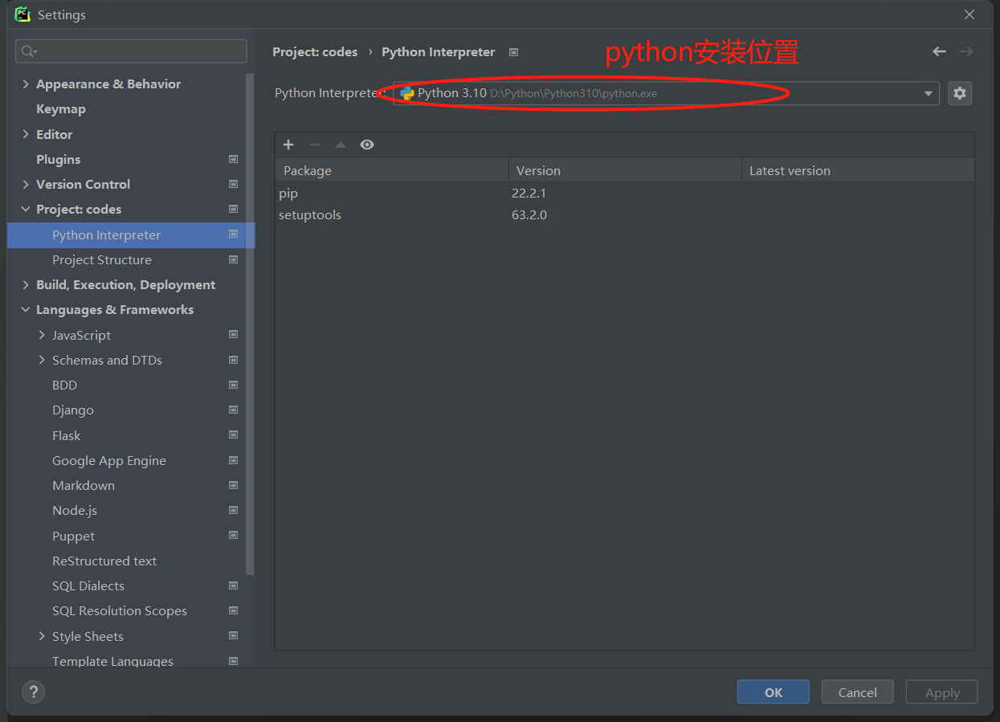
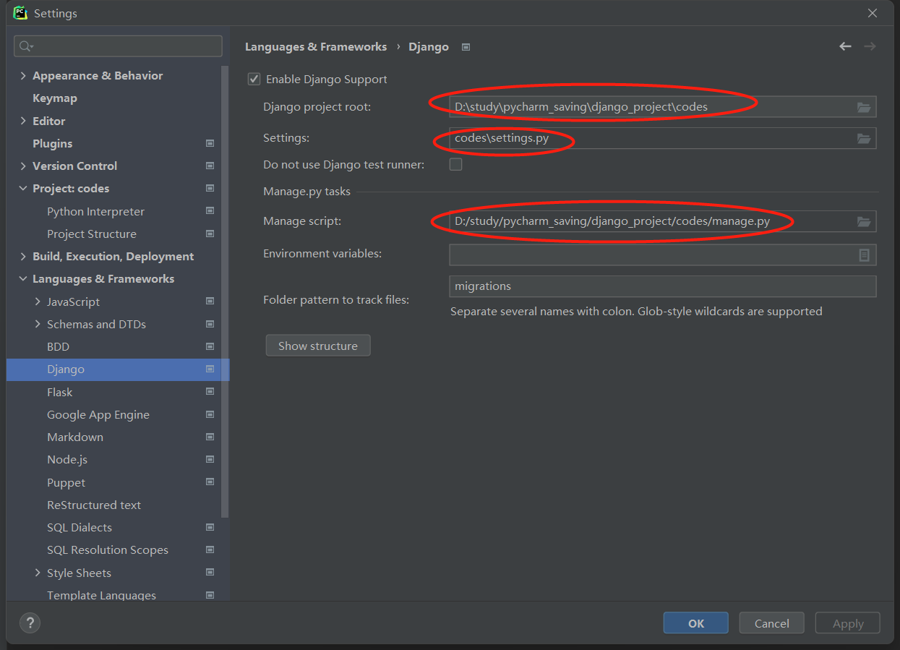
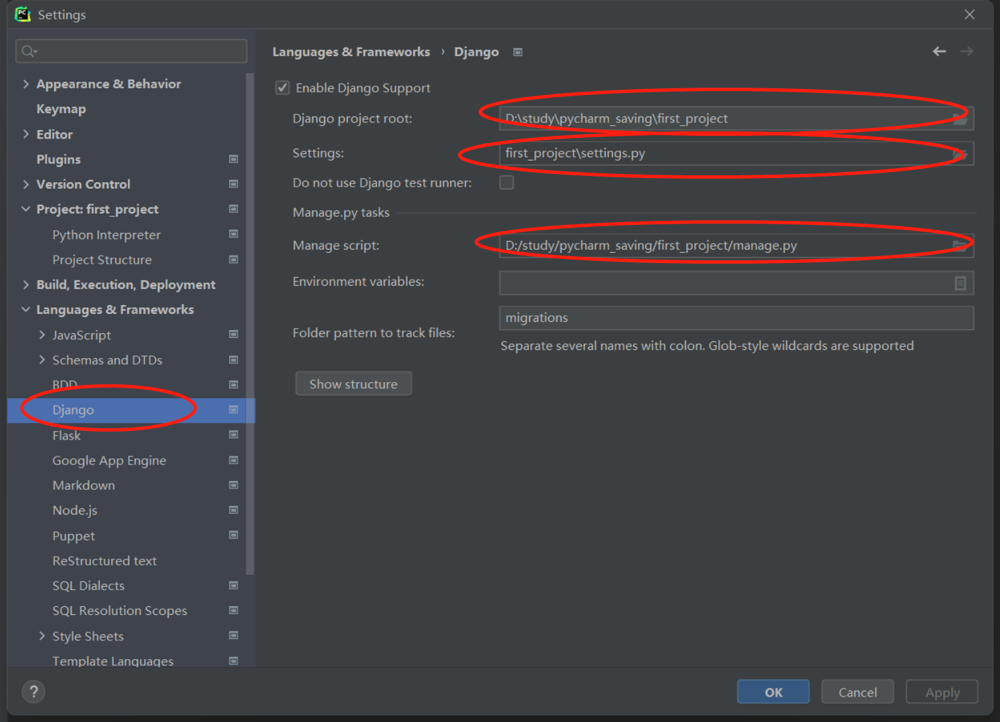

# 环境配置

* python 3.7以上
* env 虚拟环境
    >django有很多app，如果没有虚拟环境，其中有像contrib下的migrations(配置数据迁移)就全部会装在django的模块下面，如果其它项目也使用django，那么就会被共享，进而数据迁移出现问题。


## 1 安装python注意事项

### 1.1 windows

windows11下配置path为PYTHON_HOME无法成功，因为有个系统的path：`%USERPROFILE%\AppData\Local\Microsoft\WindowsApps`优先级很高，cmd输入`python`会打开microsoft store

因此在windows11可以用`py`命令代替`python`命令。

### 1.2 linux&mac

使用`python3`命令即可。

## 2 创建项目

>用windows演示，linux用python3代替py

### 2.1 创建虚拟环境并创建项目

找到项目想要存储的目录下，输入：

```
D:\study\pycharm_saving>py -m venv venv
                               |     |
                               |  当前目录下创建一个叫venv的目录
                    python虚拟环境的模块名字
D:\study\pycharm_saving>dir
2022/08/23  17:41    <DIR>          venv

D:\study\pycharm_saving>dir venv\
2022/08/23  17:41    <DIR>          Include
2022/08/23  17:41    <DIR>          Lib
2022/08/23  17:41                84 pyvenv.cfg
2022/08/23  17:41    <DIR>          Scripts

D:\study\pycharm_saving>.\venv\Scripts\activate.bat
```

就进入了虚拟环境里：

```
(venv) D:\study\pycharm_saving>
```

可以先查看一下当前虚拟环境中装了哪些模块(pip放在venv\Scripts目录下)：

```
(venv) D:\study\pycharm_saving>pip list
Package    Version
---------- -------
pip        22.2.1
setuptools 63.2.0
```

然后我们安装django，配置豆瓣的源安装快一点：

```
(venv) D:\study\pycharm_saving>pip install django -i https://pypi.douban.com/simple
```

然后在当前目录，真正创建项目目录`first_project`：

```
(venv) D:\study\pycharm_saving>django-admin startproject first_project
```

最后把当前目录下的`venv`目录放到项目`first_project`根目录下：

```
(venv) D:\study\pycharm_saving\first_project>dir
2022/08/23  18:05    <DIR>          first_project       //项目必要的配置文件
2022/08/23  18:05               691 manage.py           //项目入口文件
2022/08/23  17:41    <DIR>          venv                
```

### 2.2 配置pycharm

按理来说，pycharm会自动配置好，以防万一还是检查一下：

**Ⅰ python解释器**，也就是python执行命令：



**Ⅱ 移除venv目录**，这个目录与项目实际开发的逻辑没有什么关系：



**Ⅲ django项目配置**



## 3 创建项目下的app

在上一小节，我们将venv移到了项目根目录下，会导致使用django-admin命令报错，因为这个命令中在之前创建虚拟环境时，将虚拟环境的python命令写成了绝对路径，因此一旦移动了venv目录，就会报找不到python命令。

所以此时如果想新建app，就必须得再把venv目录移回之前创建虚拟环境的目录，这里演示是在和项目同级的目录中，然后输入命令进入虚拟环境：

```
D:\study\pycharm_saving>.\venv\Scripts\activate.bat
```

我们再进入项目目录，创建app：

```
//按理来说可以直接输入django-admin，但不知道为什么不行了。。。
(venv) D:\study\pycharm_saving\first_project>..\venv\Scripts\django-admin.exe startapp first_app
```

查看项目根目录下的文件：

```
(venv) D:\study\pycharm_saving\first_project>dir
2022/08/23  19:47    <DIR>          .idea
2022/08/23  19:39    <DIR>          first_app
2022/08/23  18:28    <DIR>          first_project
2022/08/23  18:05               691 manage.py
2022/08/23  18:28    <DIR>          __pycache__
```

此时再将venv目录移到项目根目录中。

>可能有人会嫌麻烦，就不想再移动venv目录了，不过因为我们的项目是基于这个虚拟环境的，很多的模块都是安装在这个虚拟环境中的，如果移动项目时忘记这个虚拟环境，就会导致项目无法运行，见仁见智吧...

## 4 项目结构

cmd输入：

```
>tree /f > 1.txt

first_project
│  manage.py
│  
├─first_app
│  │  admin.py
│  │  apps.py
│  │  models.py
│  │  tests.py
│  │  views.py
│  │  __init__.py
│  │  
│  └─migrations
│          __init__.py
│          
├─first_project
│  │  asgi.py
│  │  settings.py                       // 全局配置文件
│  │  urls.py                           // 路由文件
│  │  wsgi.py
│  │  __init__.py
│  │  
│  └─__pycache__
│          settings.cpython-310.pyc
│          __init__.cpython-310.pyc
│          
├─venv
│  │  pyvenv.cfg
│  │  
│  ├─Include
│  ├─Lib
│  │  
│  └─Scripts
│          activate
│          activate.bat
│          Activate.ps1
│          deactivate.bat
│          django-admin.exe
│          pip.exe
│          pip3.10.exe
│          pip3.exe
│          python.exe
│          pythonw.exe
│          sqlformat.exe
│          
└─__pycache__
        manage.cpython-310.pyc
        
```

## 5 django约定

各app之间互相独立，不要互相import。