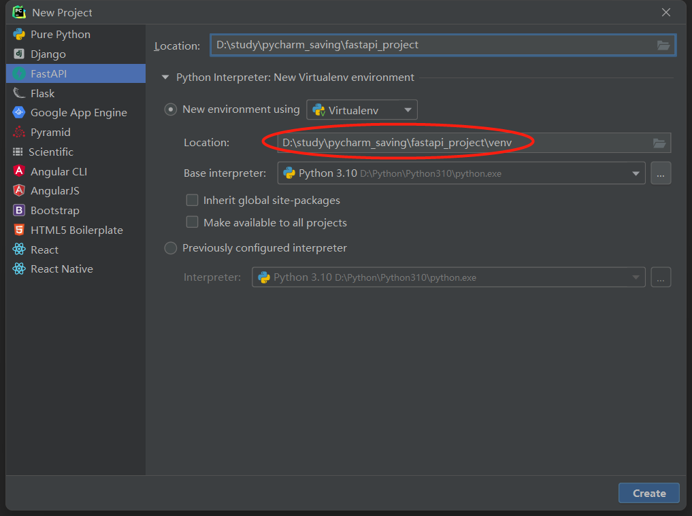

# 环境配置与创建项目

## 1 创建项目

这次不和`django`一样创建项目，而是直接使用pycharm将虚拟环境放在项目目录下（django其实也可以这样）。



本来是要进入虚拟环境，然后安装fastapi全家桶的，像下面这样：

>```
>(venv) D:\study\pycharm_saving\fastapi_project>pip install "fastapi[all]"
>```
>
>全家桶包括了 `uvicorn`，可以将其用作运行代码的服务器。

但pycharm在新建fastapi项目的时候就已经帮我们安装好了，所以就省了功夫。

创建完后的项目结构：

```
fastapi_project
│  main.py
│  test_main.http
│          
└─venv
    │  .gitignore
    │  pyvenv.cfg
    │  
    ├─Lib
    │  └─site-packages
    │              
    └─Scripts
            activate
            activate.bat
            activate.fish
            activate.ps1
            activate.xsh
            activate_this.py
            deactivate.bat
            dotenv.exe
            pip-3.10.exe
            pip.exe
            pip3.10.exe
            pip3.exe
            pydoc.bat
            python.exe
            pythonw.exe
            uvicorn.exe
            watchfiles.exe
            wheel-3.10.exe
            wheel.exe
            wheel3.10.exe
            wheel3.exe
```