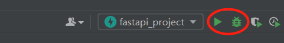

# 运行项目

## 1 初始文件内容

`main.py`：

```
from fastapi import FastAPI

app = FastAPI()


@app.get("/")
async def root():
    return {"message": "Hello World"}


@app.get("/hello/{name}")
async def say_hello(name: str):
    return {"message": f"Hello {name}"}
```

`test_main.http`：

```
# Test your FastAPI endpoints

GET http://127.0.0.1:8000/
Accept: application/json

###

GET http://127.0.0.1:8000/hello/User
Accept: application/json
```

## 2 启动项目

* 可以像这样进入虚拟环境输入命令启动项目：

```
D:\study\pycharm_saving\fastapi_project>.\venv\Scripts\activate.bat

(venv) D:\study\pycharm_saving\fastapi_project>uvicorn main:app --reload
[32mINFO[0m:     Will watch for changes in these directories: ['D:\\study\\pycharm_saving\\fastapi_project']
[32mINFO[0m:     Uvicorn running on [1mhttp://127.0.0.1:8000[0m (Press CTRL+C to quit)
[32mINFO[0m:     Started reloader process [[36m[1m19300[0m] using [36m[1mWatchFiles[0m
[32mINFO[0m:     Started server process [[36m26720[0m]
[32mINFO[0m:     Waiting for application startup.
[32mINFO[0m:     Application startup complete.
```

* 也可以直接pycharm启动（本质就是输的上方的命令）：



**最后**，直接访问 http://127.0.0.1:8000 即可